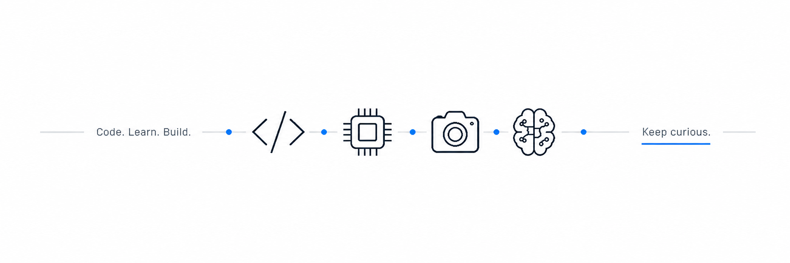

  

<h2 align="center">👋 About Me</h2>

  I'm interested in <b>Embedded Systems, Computer Vision, and Edge AI.</b>
   
  Currently learning C, embedded programming, and computer vision
   
  while strengthening my programming fundamentals.

 

<h2 align="center">📫 Contact</h2>

  
  
  

 

---

## 🔧 Tech Stack

  
  
  
  
  
  

  
  
  
  

 

---

## 📌 Projects

### 🍳 [Smart Kitchen Assistant][smart-kitchen]

Computer vision-based smart kitchen assistant with  
smoke detection, gesture control, voice-based timer guidance,  
and multi-timer functionality.

  
  
  

 

---

## 📖 Practice & Study

<table>
<tr>

<td width="33%" valign="top">

### 💻 Coding Test

Coding problem practice  
on Programmers.

🔗 [Repository][coding-test]

</td>

<td width="33%" valign="top">

### 🔵 C Programming Practice

Hands-on practice for  
C programming fundamentals.

🔗 [Repository][c-practice]

</td>

<td width="33%" valign="top">

### 🟢 STM32 Practice

Practice with STM32 peripherals  
and embedded concepts.

🔗 [Repository][stm32]

</td>

</tr>
</table>

 

---

## 🌱 Currently Learning

| Field | Learning |
| --- | --- |
| 🔌 **Embedded** | STM32 · UART · I2C · GPIO |
| 💻 **Programming** | C · Linux |
| 🧠 **AI / Vision** | Computer Vision · Edge AI |

<!-- Repository Links -->

[smart-kitchen]: https://github.com/dev-gabin/smart-kitchen-assistant
[coding-test]: https://github.com/dev-gabin/programmers-coding-test
[c-practice]: https://github.com/dev-gabin/c_basic
[stm32]: https://github.com/dev-gabin/STM32
