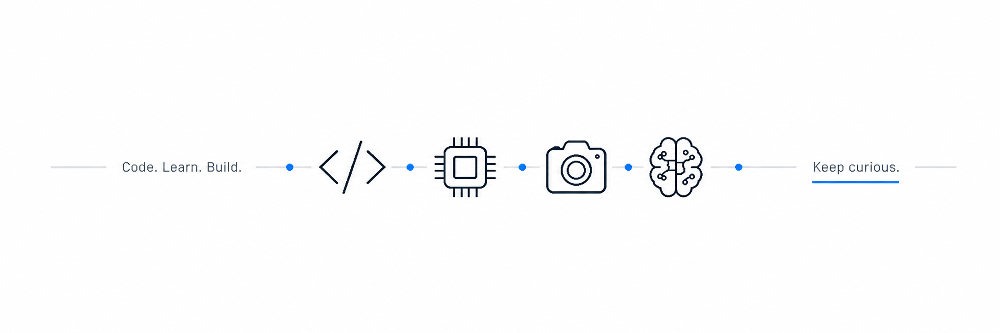

  

 

  <samp>Embedded Systems &nbsp; · &nbsp; Computer Vision &nbsp; · &nbsp; IoT</samp>

  Building practical systems across hardware, vision, and software.

 

  
  
  
  
  
  
   
  
  
  
  
  
  

 

<h2 align="center">Projects</h2>

<table align="center" width="90%">
<tr>

<td width="50%" valign="top">

<h3 align="center">Smart Kitchen Assistant</h3>

  COMPUTER VISION · AIoT

영상 인식을 기반으로 연기 감지, 제스처 제어,  
음성 타이머 기능을 결합한 스마트 주방 시스템입니다.

 

**Tech**

`Python` `YOLO` `OpenCV` `Computer Vision` `AIoT`

 

  <a href="https://github.com/dev-gabin/smart-kitchen-assistant">
    <b>View Repository →</b>
  </a>

</td>

<td width="50%" valign="top">

<h3 align="center">RC Car Project</h3>

  EMBEDDED · CONTROL SYSTEM

STM32 기반 임베디드 제어를 활용해  
차량의 주행과 하드웨어 동작을 구현한 프로젝트입니다.

 

**Tech**

`STM32` `C` `Embedded` `Motor Control` `Sensor`

 

  <a href="https://github.com/gayoung228/2026ESWContest_free_marsyaho">
    <b>View Repository →</b>
  </a>

</td>

</tr>
</table>

 

<h2 align="center">Archive</h2>

<table align="center" width="90%">
<tr>

<td width="25%" valign="top">

<h4 align="center">STM32</h4>

  EMBEDDED

MCU programming and peripheral practice.

  <a href="https://github.com/dev-gabin/STM32">
    repository →
  </a>

</td>

<td width="25%" valign="top">

<h4 align="center">Linux</h4>

  SYSTEM

Linux commands, networking and system practice.

  <a href="https://github.com/dev-gabin/linux-practice">
    repository →
  </a>

</td>

<td width="25%" valign="top">

<h4 align="center">C</h4>

  LANGUAGE

C programming practice and fundamentals.

  <a href="https://github.com/dev-gabin/c_basic">
    repository →
  </a>

</td>

<td width="25%" valign="top">

<h4 align="center">Coding Test</h4>

  PRACTICE

Coding-test practice and problem solving.

  <a href="https://github.com/dev-gabin/programmers-coding-test">
    repository →
  </a>

</td>

</tr>
</table>

 

  Code. Learn. Build. &nbsp; — &nbsp; Keep curious.

